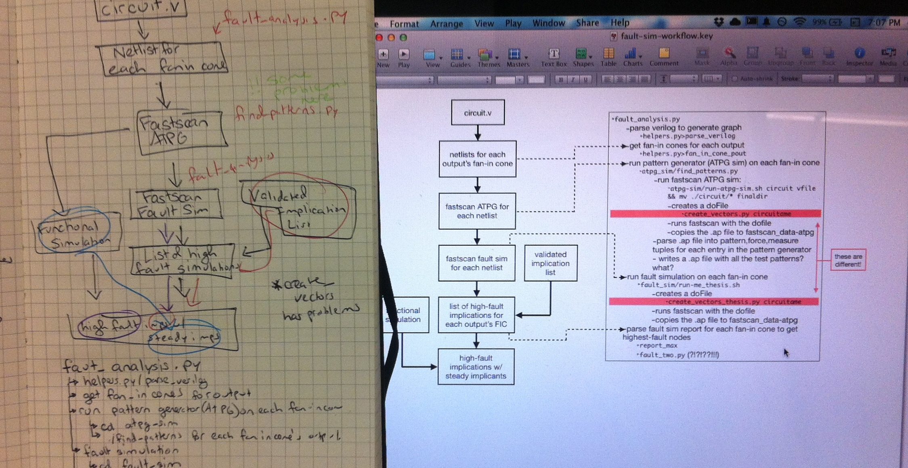
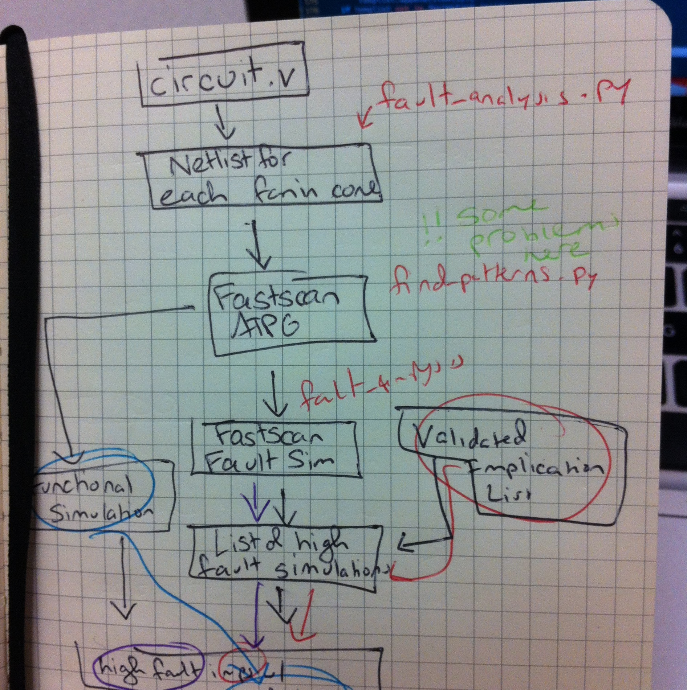

## Day 2 (7/2)
  + A good comparison for my current workflow is like slowly and carefully chipping away
  at an iceberg of code and data in hopes of one day carving it into a beautiful ice
  sculpture. Until then it's a big scary melting mess. I say melting because today,
  in the middle of all my testing and careful examining and simulations, the 
  license servers went down (I think). All I know is my simulations stopped working
  because of a missing or invalid license, and I e-mailed the Brown administrator
  for these things with no response yet (to be fair, he probably had gone home). So
  that probably accounted for many of the perplexities I dealt with today, and
  I wouldn't have even caught it because all system output from the simulation 
  program was piped to /dev/null.
  + There are two folders where steps of fault simulation happen, fault-sim and
  atpg-sim. These folders have almost identical contents, aside from additions
  to some lines of some files and commented out lines in various different places
  in each set. The run-me.sh files do almost the same thing, just with slightly
  different parameters and names given to fastscan, and the readme files are both
  the same and totally irrelevant to the function of the files in the folder. 
  + So,
  today I did some housecleaning, deleting and renaming and commenting each of them.
  There's a lot of code that's commented out in each run-me.sh script (which I have
  officially renamed run-fault-sim and run-atpg-sim) and I was in the process of 
  figuring out how much original functionality each script conducts, but then the
  server went down and I couldn't test it. 
  
  + My work for this week has effectively straddled two areas: understanding the code
  and understanding the simulation output files. I need to understand the code so
  I can fix/improve/add to it, and I need to understand what the simulation files
  look like so I can manipulate them as I add to the automation tools. To that end,
  I moved my flow-chart-to-code mapping to the 21st century and started connecting
  them in a powerpoint file, which was actually really useful because at some point
  it's easier to use a computer than pen-and-paper for outlining things.
  Most importantly, it really helped me visualize some of the moving parts that I couldn't
  figure out because of this nice same-name-differnet-folder fun. There are still some
  missing pieces, but I feel a lot more confident in my understanding of the 
  code now that I could actually connected ideas to code.

## Day 1 (7/1)
  + Ack! Can you believe it's week four already?! I've hardly done
  anything! Today was productive though.
  + My first order of business was to visually map out the fault
  analysis code, as per all the literature proposed it would run,
  and then connect steps of the verbal process with python files and
  bash scripts in the various folders. It looked like this
  
  when I was done with it.
  + Once I felt comfortable with the order of the code execution, I went
  into each file and drilled down into each call for each script to 
  figure out when everything was going. I was really happy with the 
  progress I was making in the file when I got to the part where
  the fault simulations were supposed to happen. But that script kept
  throwing errors, and when I went to look around, I realized pretty
  much every functional line of code in that script had been commented
  out, so it was doing nothing. Why? Who knows. That's on tomorrow's TODO.
  + Then, to add to my confusion, once I reached the end of what seemed to
  be the all-encompassing fault_simulation script, I saw it made a
  call to execute another script, called fault_two. What's fault_two?
  From my cursory investigation, it seems to be an almost exact copy of
  the first fault_simulation script. Why is everything happening twice?
  Again, tomorrow's TODO. Mysteries galore today.
 
